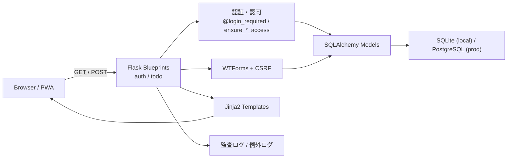

# Flask ToDo Pro（Render + PWA）

スマホでも見栄え良く使える **ToDo / Wish / サブタスク / プロジェクト / チーム共有** 対応のFlaskアプリです。

---

## このアプリで「できること」

- ユーザー登録・ログインして、自分だけのタスクを管理できる
- タスクを **TODO → DOING → DONE** のカンバンボードで視覚的に管理できる
- 「いつかやりたいこと」を **Wish リスト**として分けて管理できる
- タスクに **締切**を設定し、残り日数や期限切れを一目で確認できる
- タスクを **サブタスク**（小さなステップ）に分けて進捗を管理できる
- **チーム**を作って、メンバーとタスクやプロジェクトを共有できる

---

## 画面・機能の一覧

| 画面 | URL | できること |
|------|-----|-----------|
| ユーザー登録 | `/auth/register` | 新しいアカウントを作る |
| ログイン | `/auth/login` | アカウントに入る（「ログイン状態を保持」対応） |
| ボード（メイン画面） | `/todo/` | タスク一覧をカンバン形式で表示・絞り込み・検索 |
| タスク作成 | `/todo/tasks/new` | 新しいタスクを追加（プロジェクト・締切の設定も可） |
| タスク詳細 | `/todo/tasks/<id>` | タスクの編集・サブタスク追加・進捗確認・削除 |
| プロジェクト一覧 | `/todo/projects` | プロジェクトの作成・削除 |
| チーム一覧 | `/todo/teams` | チーム作成 |
| チーム詳細 | `/todo/teams/<id>` | メンバー追加・削除（オーナーのみ削除可） |

---

## アーキテクチャ図



### レイヤごとの役割

- `app/auth/routes.py` と `app/todo/routes_*.py` が HTTP の入口になり、認証・認可・バリデーション・永続化を順番に組み立てる
- `app/todo/shared.py` と各モデルの `can_access()` が「誰がどこまで見てよいか」の判定を集約する
- `app/forms.py` が入力形式とパスワードポリシーを担保し、`Flask-WTF` が CSRF を自動検証する
- `app/db_utils.py` が DB 書き込み失敗時の `rollback()` と例外ログ出力を共通化し、更新系ルートは `commit()` 失敗後にセッションを壊したまま残さない
- `app/__init__.py` が Cookie 属性、CSP、HSTS、ProxyFix など「アプリ全体に効く安全装置」をまとめて初期化する

---

## セキュリティ設計の要点

| 観点 | どこで守るか | 具体策 |
|------|--------------|--------|
| 本人確認 | `app/auth/routes.py` | ログイン、セッション、remember cookie、Open Redirect 対策 |
| 認可 | `app/todo/shared.py`, `app/models.py` | 他人のタスク・他チームのプロジェクトを `403` で拒否 |
| フォーム改ざん | `Flask-WTF`, 各 route | CSRF トークン検証、`project_id`・`status` の再検証 |
| ユーザー列挙対策 | 認証・チーム追加 UI | ログイン失敗、登録重複、チーム追加失敗の文言を汎用化 |
| DB 障害耐性 | 更新系 route + `app/db_utils.py` | `db.session.commit()` を `try/except` で囲み、失敗時は `rollback()` と例外ログ |
| ブルートフォース耐性 | `app/security.py` | ログイン/登録に IP ベースのレート制限 |
| ブラウザ側防御 | `app/__init__.py` | CSP, HSTS, `X-Frame-Options`, `HttpOnly`, `SameSite=Lax` |

### 面接で説明しやすいポイント

- 認証と認可を分離しており、「ログインしている」と「そのデータに触れてよい」は別レイヤで確認している
- DB 書き込みは成功系だけでなく失敗系も設計しており、例外時に `rollback()` して次のリクエストへ壊れたセッション状態を持ち越さない
- UI に返す文言は必要以上に内部状態を漏らさず、詳細はサーバーログへ寄せて運用調査性と公開情報量を分離している

---

## 全体の処理の流れ（最重要）

### リクエストの基本的な流れ

```
ブラウザ（ユーザーの操作）
  ↓  HTTPリクエスト（URLにアクセス）
Flask ルーティング（URLに対応する関数を呼ぶ）
  ↓
認証チェック（@login_required = ログインしてる？）
  ↓
認可チェック（= そのデータを見る権限がある？）
  ↓
バリデーション（= 入力内容は正しい？）
  ↓
DB操作（SQLAlchemy でデータを保存/取得/削除）
  ↓
テンプレート描画（Jinja2 で HTML を組み立てる）
  ↓
ブラウザに HTML を返す → 画面表示
```

### 主要フローの詳細

**ユーザー登録の流れ**
1. `/auth/register` にアクセス → 登録フォームを表示
2. フォーム送信 → レート制限チェック（= 短時間に何度も送れないようにする）
3. CSRF トークン検証（= 外部サイトからの不正な送信を防ぐ）
4. 入力チェック（ユーザー名の重複・パスワード強度）
5. パスワードをハッシュ化（= 元に戻せない形に変換して安全に保存）
6. DB に User レコードを保存 → 自動ログイン → ボードへリダイレクト

**ログインの流れ**
1. `/auth/login` にアクセス → ログインフォームを表示
2. フォーム送信 → レート制限チェック
3. DB からユーザーを検索 → パスワード照合
4. 成功 → セッション（= ログイン状態の記録）を作成 → ボードへ
5. 失敗 → 失敗回数を記録（連続失敗でロックアウト）

**タスク作成の流れ**
1. ボード画面で「新規タスク」を押す → `/todo/tasks/new`
2. フォームにタイトル・説明・ステータス・締切・プロジェクトを入力
3. 送信 → 認証チェック → 入力チェック
4. DB に Task レコードを保存 → ボードへリダイレクト

**タスク更新・削除の流れ**
1. タスク詳細画面 → 編集フォーム or 削除ボタン
2. 認証チェック → **認可チェック**（= 自分のタスク or チームメンバーか？）
3. DB を更新 or 削除 → リダイレクト

---

## データの流れ

```
【入力】ブラウザのフォーム
    ↓  POST リクエスト（フォームデータを送信）
【サーバ】Flask が受け取る
    ↓  WTForms でバリデーション（入力チェック）
    ↓  SQLAlchemy でオブジェクトに変換
【DB】PostgreSQL（本番）/ SQLite（ローカル）に保存
    ↓
【取得】SQLAlchemy がDBからデータを取得
    ↓  Python オブジェクトとして扱える
【表示】Jinja2 テンプレートに渡して HTML を生成
    ↓
【ブラウザ】HTML を受け取って画面に表示
```

**ポイント**
- ユーザーが直接 DB を触ることはない。必ず Flask（サーバー側）を経由する
- データを取得するときも「この人が見ていいデータか？」を毎回チェックしている
- フォームには CSRF トークン（= 本物のフォームである証明）が自動で埋め込まれる

---

## フォルダ・主要ファイルの役割

```
flask_todo_pro/
├── app/                    … アプリ本体
│   ├── __init__.py         … アプリの組み立て（Factory）、セキュリティヘッダー設定
│   ├── models.py           … DBテーブルの定義（User / Team / Project / Task / SubTask）
│   ├── forms.py            … 入力フォームの定義と入力チェックルール
│   ├── security.py         … レート制限（= 連続アクセスをブロックする仕組み）
│   │
│   ├── auth/               … 認証まわり（ログイン・登録・ログアウト）
│   │   └── routes.py       … /auth/ 以下のURL処理
│   │
│   ├── todo/               … タスク管理まわり
│   │   ├── routes_tasks.py … タスク・サブタスクの作成/編集/削除
│   │   ├── routes_board.py … カンバンボード画面（メイン画面）
│   │   ├── routes_teams.py … チーム管理
│   │   ├── routes_projects.py … プロジェクト管理
│   │   └── shared.py       … 認可チェックなど共通処理をまとめたファイル
│   │
│   └── static/             … CSS / JS / アイコン / PWA 関連ファイル
│       └── vendor/         … Bootstrap（見た目のライブラリ）をローカル配信
│
├── config.py               … 設定ファイル（DB接続先・パスワードポリシー・レート制限値など）
├── wsgi.py                 … 本番用の起動ファイル（Gunicorn が読む）
├── run.py                  … ローカル開発用の起動ファイル
├── migrations/             … DBマイグレーション（= テーブル構造の変更履歴）
├── tests/                  … テストコード（pytest）
├── render.yaml             … Render デプロイ設定
├── requirements.txt        … 本番用の依存パッケージ一覧
└── requirements-dev.txt    … 開発用の追加パッケージ（pytest 等）
```

---

## Render / PostgreSQL のポイント

| 項目 | 説明 |
|------|------|
| **Render** | アプリをインターネットに公開するホスティングサービス |
| **PostgreSQL** | 本番で使うデータベース。Render が提供してくれる |
| **SQLite** | ローカル開発で使う軽量DB。ファイル 1 つ（`todo_app.db`）で動く |
| **DATABASE_URL** | DB の接続先。Render Blueprint なら自動で設定される |
| **SECRET_KEY** | セッション暗号化などに使う秘密の文字列。本番では必ず環境変数で設定 |
| **マイグレーション** | DB のテーブル構造を安全に変更する仕組み（`flask db upgrade`） |
| **Gunicorn** | 本番用の Web サーバー。`wsgi.py` を読み込んでアプリを動かす |

**本番とローカルの切り替え**
- `config.py` が `DATABASE_URL` 環境変数の有無で自動的に PostgreSQL / SQLite を切り替える
- `wsgi.py`（本番）は `SECRET_KEY` がないと起動しない（安全装置）
- `run.py`（ローカル）は `SECRET_KEY` がなくても開発用のデフォルト値で動く

---

## ローカル起動手順

前提: Python 3.11 以上を推奨。

### Windows（コマンドプロンプト）

```bat
python -m venv .venv
.\.venv\Scripts\activate
python -m pip install --upgrade pip
pip install -r requirements.txt
pip install -r requirements-dev.txt
python -m flask --app wsgi.py db upgrade
python run.py
```

### macOS / Linux

```bash
python -m venv .venv
source .venv/bin/activate
python -m pip install --upgrade pip
pip install -r requirements.txt
pip install -r requirements-dev.txt
python -m flask --app wsgi.py db upgrade
python run.py
```

起動後：

- ブラウザで `http://127.0.0.1:5000/`
- まず `/auth/register` でユーザー登録 → ログイン

ローカルでは SQLite を使い、プロジェクト直下に `todo_app.db` が作成されます。

---

## Renderで公開（概要）

`render.yaml` と `Procfile` が入っています。

- Build Command: `pip install -r requirements.txt`
- Start Command: `python -m flask --app wsgi.py db upgrade && gunicorn wsgi:app`

環境変数（Render側で設定）:

- `SECRET_KEY`：ランダムな長い文字列
- `DATABASE_URL`：Postgresの接続先（Blueprint を使うと自動で入る）

### Render Blueprint で一発構築（Web + Postgres）

1. GitHub に push（`render.yaml` がリポジトリ直下にある状態）
2. Render Dashboard → **New → Blueprint**
3. GitHub リポジトリを選択して **Apply / Create**
4. 自動で Web Service + Postgres DB が作成され、`DATABASE_URL` も自動注入される
5. デプロイ完了後、表示される `https://...onrender.com` が公開URL

### Flask-Migrate (Alembic) 手順

このリポジトリには `migrations/` が含まれているため、通常は `db upgrade` のみで起動できます。

```bash
# 初回（migrations/ がまだ無い場合のみ）
python -m flask --app wsgi.py db init
python -m flask --app wsgi.py db migrate -m "Initial migration"
python -m flask --app wsgi.py db upgrade

# 2回目以降（モデル変更時）
python -m flask --app wsgi.py db migrate -m "..."
python -m flask --app wsgi.py db upgrade

# 既存DBが create_all ベースの場合（table already exists エラー対策）
python -m flask --app wsgi.py db stamp head
python -m flask --app wsgi.py db upgrade
```

---

## Demo（公開URL）

- 公開URL（Render）：`https://flask-todo-pro-pwa.onrender.com`（※デプロイ後にここを更新）
- ソースコード（GitHub）：`https://github.com/orionkokonen/flask_todo_pro`

---

## PWA（ホーム画面に追加 → アイコン起動）

公開URLを **HTTPS** で開くと、ブラウザの「ホーム画面に追加」でインストールできます。

- マニフェスト：`/manifest.webmanifest`
- Service Worker：`/sw.js`

---

## 更新履歴

詳細な改善履歴は `CHANGELOG.md` を参照してください。

- 直近の主な更新: 2026-03-04
- 内容: タスクカード操作性の改善、PWA キャッシュ更新まわりの修正、タスクカード表示の共通化

---

## 今後の開発計画

詳細は `ROADMAP.md` を参照。

---

## Security Notes

- Password policy requires `min=12` plus at least one uppercase letter, one lowercase letter, and one digit for new registrations.
- CSRF protection is enabled globally via Flask-WTF.
- Session and remember cookies use `HttpOnly` and `SameSite=Lax`; production-equivalent runs also enable `Secure`, and `remember me` is capped at 30 days.
- Login `next` redirect allows only same-origin targets.
- Login and registration use a simple in-memory rate limit to slow repeated attempts. With multiple Gunicorn workers, each process keeps its own counter, so two workers can effectively allow roughly double the attempts.
- Registration, login, and team-member-add flows avoid explicit existence messages in the UI to reduce user-enumeration hints.
- Mutation routes wrap `db.session.commit()` in `try/except` and call `rollback()` on failure before returning control to the user.
- `PROXY_FIX_TRUSTED_HOPS` defaults to `0` so forwarded client IP headers are ignored by default; set it to `1` behind a single trusted reverse proxy such as Render.
- Security headers include CSP, `X-Frame-Options`, `X-Content-Type-Options`, `Referrer-Policy`, and `Permissions-Policy`. CSP now blocks inline scripts, while inline styles remain allowed for template compatibility.
- Password reset is not implemented yet; a production build should add an email or SMS reset flow.
- Team project deletion is limited to the team owner.
- Team member invites are intentionally allowed for existing members; member removal remains owner-only.
- `lazy="dynamic"` relationships are used on purpose where views/templates need `count()` and filtered subqueries.
- Startup runs `db upgrade` before serving, and migration failures are treated as fail-fast to avoid running against an out-of-sync schema.
